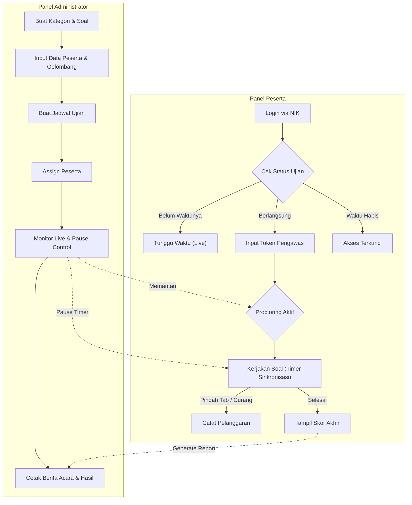

# CAT UNSUB (Computer Assisted Test)

CAT UNSUB adalah sebuah sistem ujian berbasis komputer (Computer Assisted Test) komprehensif yang dikembangkan khusus untuk memfasilitasi pelaksanaan ujian seleksi, ujian akademik, maupun simulasi ujian secara digital. 

Sistem ini didesain dengan tingkat keamanan tinggi (*Proctoring*), manajemen waktu absolut (sinkronisasi batas waktu), dan *output* dokumen cetak (*Printables*) interaktif yang mempermudah panitia seleksi, khususnya di Universitas Subang (UNSUB).

---

## 🛠️ Teknologi yang Digunakan (Tech Stack)

Aplikasi ini dibangun menggunakan tumpukan web modern dengan performa tinggi:
- **Framework Utama:** [Laravel 13+](https://laravel.com/) (PHP)
- **Frontend & Reaktivitas:** [Livewire 3](https://livewire.laravel.com/) (Untuk navigasi SPA / Single Page Application yang sangat cepat tanpa reload halaman penuh)
- **Styling:** [Tailwind CSS 3](https://tailwindcss.com/) (Menghasilkan UI yang modern, estetik, dan responsif)
- **Interaktivitas Tambahan:** [Alpine.js](https://alpinejs.dev/)
- **Database:** MySQL / MariaDB

---

## 🌟 Fitur Utama (Core Features)

### 👨‍💼 Panel Administrator (Panitia)
- **Manajemen Bank Soal & Kategori:** Mengelola ratusan soal (Pilihan Ganda & Essay) lengkap dengan penentuan bobot nilai (poin) secara fleksibel.
- **Manajemen Ujian Lanjut (Advanced Exam Manager):**
  - Mengatur batas waktu ujian Absolut (`start_time` & `end_time`).
  - *Timer Sinkronisasi*: Memastikan ujian berhenti secara otomatis pada `end_time` terlepas dari kapan peserta login, menanggulangi *cheat* perpanjangan waktu lokal.
  - Dukungan **Token Ujian** dinamis untuk otentikasi sesi.
  - Mengatur *Passing Grade* (Nilai Kelulusan).
- **Manajemen Gelombang (Waves) & Peserta:** Pengelompokan peserta ke dalam sesi / ruang kelas ujian (*Assign Bulk*).
- **Pemantauan Ujian Langsung (Live Monitoring):** Memantau peserta yang sedang ujian secara *real-time* tanpa perlu me-*refresh* halaman.
- **Kendali Kedaruratan (Pause & Freeze):** 
  - Admin dapat mem-pause (menjeda) timer peserta jika terjadi masalah teknis jaringan/PC. 
  - Timer peserta akan membeku (freeze) dan ujian akan otomatis terkunci sampai admin me-resume kembali.
- **Interactive Printables (Dokumen Cetak Cerdas):**
  - **Daftar Hadir (Attendance):** Input nama Pengawas secara dinamis (via prompt) sebelum mencetak dokumen.
  - **Berita Acara Ujian:** Tata letak (*layout*) pintar yang mencegah terpotongnya area tanda tangan (Smart Break-Inside Avoid).
  - **Rincian Jawaban Peserta:** Logik detail jawaban Benar/Salah dan Jawaban Kosong.
  - **Form Kejadian Khusus (Incident Report):** Formulir cetak *editable* (Content-Editable) yang memungkinkan pengawas mengetik laporan (Waktu Kejadian, Kronologi, dll) langsung di browser sebelum dokumen diprint, atau mencetaknya dalam keadaan kosong (bergaris) untuk ditulis tangan.

### 🧑‍🎓 Panel Peserta (Ujian)
- **Login Praktis:** Peserta hanya perlu masuk menggunakan Nomer Token atau Nomor Peserta tanpa kerumitan menghafal password.
- **Dasbor Eksekusi Cerdas (Smart Execution Dashboard):** 
  - Menampilkan status ujian (Belum Dimulai, Mulai, Waktu Habis, Selesai) yang tersinkron secara *live*.
  - Melarang akses ganda pada ujian yang sama jika statusnya sedang berjalan (mencegah *multi-login*).
- **Sistem Keamanan Pelanggaran (Basic Proctoring):**
  - Mendeteksi dan mencatat *log* jika peserta mencoba berpindah *tab/browser* (Window Blur).
  - Mendeteksi jika peserta keluar dari layar penuh (Exit Fullscreen).
  - Mendeteksi jika peserta mengubah ukuran jendela browser (Window Resize).
- **Ujian Interaktif:** Navigasi soal tanpa memuat ulang halaman (*No Reload*), indikator warna (Terjawab, Ragu, Belum Terjawab), dan integrasi penghitung waktu (Countdown Timer) yang stabil.
- **Simulasi & Try Out:** Mode khusus untuk mencoba ujian berulang kali (Kerjakan Ulang) guna kepentingan simulasi CAT.

---

## 🔀 Alur Sistem (System Flow)



---

## 🚀 Panduan Instalasi (Development)

Sistem ini membutuhkan perangkat lunak dasar berikut:
- **PHP** (Minimal versi 8.2)
- **Composer** (Package Manager PHP)
- **Node.js & NPM** (Untuk kompilasi frontend TailwindCSS)
- **Database Server** (MySQL/MariaDB) disarankan berjalan dengan aturan Strict Mode.

### Langkah-langkah:
1. **Clone repositori:**
   ```bash
   git clone https://github.com/bagusaliakbar/cat-unsub.git
   cd cat-unsub
   ```

2. **Install Dependensi Backend (Composer):**
   ```bash
   composer install
   ```

3. **Install Dependensi Frontend (NPM):**
   ```bash
   npm install
   npm run build
   ```
   *(Gunakan `npm run dev` jika Anda berencana mengedit file `.blade.php` atau kelas CSS bawaan).*

4. **Konfigurasi Lingkungan (*Environment*):**
   Salin contoh file pengaturan environment:
   ```bash
   cp .env.example .env
   ```
   Edit file `.env` yang baru dibuat dengan menghubungkannya ke Database Anda:
   ```env
   DB_CONNECTION=mysql
   DB_HOST=127.0.0.1
   DB_PORT=3306
   DB_DATABASE=db_cat_unsub
   DB_USERNAME=root
   DB_PASSWORD=
   ```

5. **Generate Kunci Enkripsi Aplikasi:**
   ```bash
   php artisan key:generate
   ```

6. **Migrasi Database & Seeding Data Dummy:**
   Perintah ini akan membuat struktur tabel lengkap beserta satu akun Administrator (`admin@admin.com`) dan beberapa akun Peserta percontohan.
   ```bash
   php artisan migrate --seed
   ```

7. **Jalankan Server Lokal:**
   ```bash
   php artisan serve
   ```
   Aplikasi siap diakses melalui browser di alamat `http://localhost:8000`.

---

## 🔑 Hak Akses Bawaan (Default Credentials)

**Administrator:**
- **URL Login Admin:** `http://localhost:8000/login`
- **Email:** `admin@admin.com`
- **Password:** `password`

**Peserta Ujian (Simulasi/Testing):**
- **URL Login Peserta:** `http://localhost:8000/` (Halaman Utama)
- **Contoh NIK untuk login:**
  - `P-001` (Budi Santoso)
  - `P-002` (Siti Aminah)
  - `P-003` (Agus Pratama)


